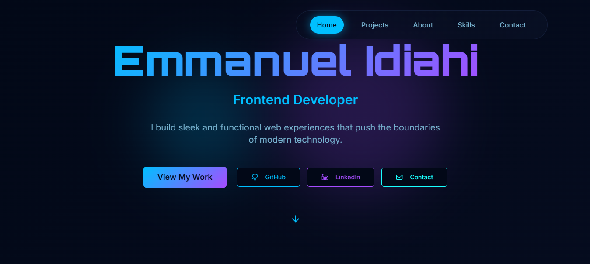

# Emmanuel Idiahi Portfolio &nbsp;  


=======


---

## 🚀 Live Portfolio

🔗 [emmanuel-idiahi.netlify.app](https://emmanuel-idiahi.netlify.app/)
=======

---

## 👋 Welcome

Welcome to the official repository for **Emmanuel Idiahi's Portfolio**!  
This project highlights my professional journey, skills, and projects, featuring a modern, responsive design built with cutting-edge web technologies.

---

## ✨ Features

- 👤 **Personal Introduction**
- 🌟 **Project Showcase**
- 🛠️ **Skills & Technologies**
- 📧 **Contact Information**
- 📱 **Responsive Design** (Mobile & Desktop)

---

## 🛠️ Tech Stack


-  TypeScript
-  React
-  CSS
-  HTML5
=======
<div>
  
  
  
  
</div>


---

## 📦 Installation

```bash
git clone https://github.com/Reteecent/emmanuel-idiahi-portfolio.git
cd emmanuel-idiahi-portfolio
npm install
npm start
```

---

## 🌐 Usage

- Explore Emmanuel's professional background and completed projects.
- Use the contact section to inquire about collaborations or opportunities.

---

## 📄 License

This project is licensed under the [MIT License](./LICENSE).

---

## 🤝 Contributing

Contributions are always welcome!  
Fork the repository, create a new branch, and submit a pull request.  
Feel free to open issues for suggestions or bug reports.

---

## 📫 Contact

- 💼 [Portfolio Source on GitHub](https://github.com/Reteecent/emmanuel-idiahi-portfolio)
=======
- 💼 [Emmanuel Idiahi's GitHub](https://github.com/Reteecent/emmanuel-idiahi-portfolio)

- 📬 For inquiries, [open an issue](https://github.com/Reteecent/emmanuel-idiahi-portfolio/issues) or use the contact form on the live portfolio.

---

_Built and maintained with ❤️ by [Reteecent](https://github.com/Reteecent)_
=======
<p align="center">
  Made with ❤️ by <a href="https://github.com/Reteecent">Reteecent</a>
</p>
